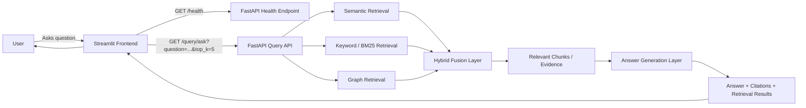

# NCERT Physics Hybrid RAG System

A hybrid Retrieval-Augmented Generation system for question answering over the NCERT Physics textbook. The project combines a FastAPI backend, a Streamlit frontend, and multiple retrieval strategies so that answers stay grounded in textbook evidence instead of unsupported generation [cite:583][cite:493].

## Project overview

This project is designed to answer natural-language questions from NCERT Physics by retrieving relevant passages and then generating a grounded answer from those passages. The current setup uses a frontend chat interface, a FastAPI backend, health checking for service availability, and a query endpoint that returns answers with citations and retrieval evidence [cite:548][cite:564].

## Main features

- Hybrid retrieval pipeline combining semantic retrieval, keyword retrieval, and graph-aware retrieval to improve recall and grounding.
- FastAPI backend for API routing, query handling, and health checks [cite:548].
- Streamlit frontend for interactive question asking and answer display [cite:566][cite:573].
- Citation-oriented response pattern so that answers can be traced back to source chunks.
- Health-check driven connectivity validation between frontend and backend, which is a standard reliability pattern in service-based applications [cite:549][cite:548].

## Architecture

The system follows a frontend-to-backend architecture in which the Streamlit app sends user questions to the FastAPI API, the API runs hybrid retrieval over indexed NCERT content, and the response returns an answer plus evidence. Mermaid is commonly used to document this kind of application flow in a readable, version-controlled text format [cite:585][cite:582].



## Repository structure

A good README should explain the important entry points, running instructions, and where to find the main parts of the system so that a new contributor can understand the repo quickly [cite:580][cite:586]. A practical structure for this project is:

```text
project-root/
│
├── backend/
│   ├── app/
│   │   ├── main.py
│   │   ├── api/
│   │   ├── services/
│   │   └── models/
│
├── frontend/
│   └── app.py
│
├── data/
│   ├── raw/
│   ├── chunks/
│   └── indexes/
│
├── output/
│   ├── README.md
│   ├── architecture-mermaid.md
│   └── project-report.md
│
├── requirements.txt
└── .env
```

## Tech stack

| Component | Technology | Purpose |
|---|---|---|
| Frontend | Streamlit [cite:566] | Chat-style UI for asking questions |
| Backend | FastAPI [cite:493] | API endpoints, routing, and service logic |
| Connectivity check | `/health` endpoint [cite:548][cite:549] | Confirms backend availability |
| Query endpoint | `/query/ask` | Accepts question input and returns grounded response |
| Documentation | Markdown + Mermaid [cite:585][cite:583] | Project docs and architecture diagrams |

## How it works

1. The user enters a question in the Streamlit interface.
2. The frontend sends a health request to confirm that the backend is available before or during usage, which is a common operational pattern for API reliability [cite:549][cite:548].
3. The frontend sends the actual query to the FastAPI endpoint.
4. The backend runs hybrid retrieval to collect the most relevant textbook chunks.
5. The system produces a grounded answer using retrieved evidence.
6. The frontend displays the answer and citations.

## Local setup

README guidance usually works best when it includes copy-paste-ready commands and short sections for setup and usage [cite:583][cite:580]. A typical local setup is:

### 1. Create and activate a virtual environment

```powershell
python -m venv .venv
.\.venv\Scripts\Activate.ps1
```

### 2. Install dependencies

```powershell
pip install -r requirements.txt
```

### 3. Start the FastAPI backend

```powershell
python -m uvicorn backend.app.main:app --reload
```

### 4. Start the Streamlit frontend

```powershell
streamlit run frontend/app.py
```

### 5. Open the app

- Frontend: `http://localhost:8501`
- Backend docs: `http://127.0.0.1:8000/docs`

## Frontend-backend connection

The current frontend uses Python `requests` inside Streamlit to call the backend health endpoint and query endpoint, which is a straightforward way to connect Streamlit and FastAPI applications [cite:564][cite:571]. The use of `st.chat_input`, `st.chat_message`, and `st.session_state` is consistent with Streamlit’s chat-app design pattern [cite:566][cite:573].

## CORS note

If the frontend is ever moved to a browser-based app that uses JavaScript to call the backend directly from a different origin, FastAPI should be configured with `CORSMiddleware` so that cross-origin requests are permitted when appropriate [cite:493][cite:581]. This is especially relevant for static HTML frontends or split deployments where frontend and backend are hosted on separate domains [cite:493].

## Health check

A dedicated health endpoint is useful because it lets the frontend quickly determine whether the backend is alive before sending real query traffic. Health checks are widely used to improve observability and reliability in modern application deployments [cite:549][cite:548].

## Suggested improvements

- Add a sidebar in Streamlit for `top_k`, backend URL, and model settings.
- Render citations in expandable sections for better readability.
- Show retrieval evidence categories separately: semantic, keyword, graph, and fused output.
- Add persistent logging for demo sessions and debugging.
- Add deployment instructions for Railway or another cloud platform.

## Documentation files

This project package includes:

- `README.md` — repository overview and setup guide.
- `architecture-mermaid.md` — Mermaid architecture code for live editor use.
- `project-report.md` — detailed technical report.

## License

Add the project’s preferred license before publishing the repository. README best-practice guidance recommends including licensing information clearly so other users know how the code may be reused [cite:583].
